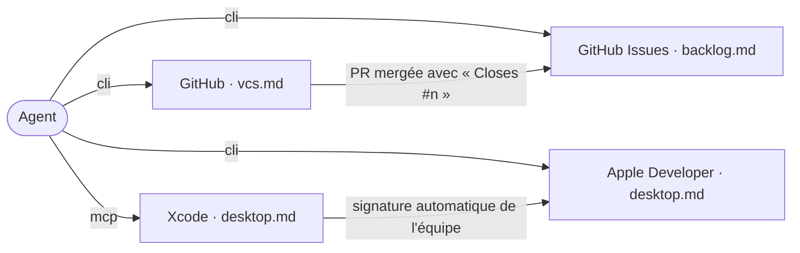

# Ecosystem

```mermaid
flowchart LR
  Agent([Agent])
  Vcs["GitHub · vcs.md"]
  Tracker["GitHub Issues · backlog.md"]
  Xcode["Xcode · desktop.md"]
  AppleDev["Apple Developer · desktop.md"]

  Agent -- cli --> Vcs
  Agent -- cli --> Tracker
  Agent -- mcp --> Xcode
  Agent -- cli --> AppleDev

  Vcs -- "PR mergée avec « Closes #n »" --> Tracker
  Xcode -- "signature automatique de l'équipe" --> AppleDev
```
